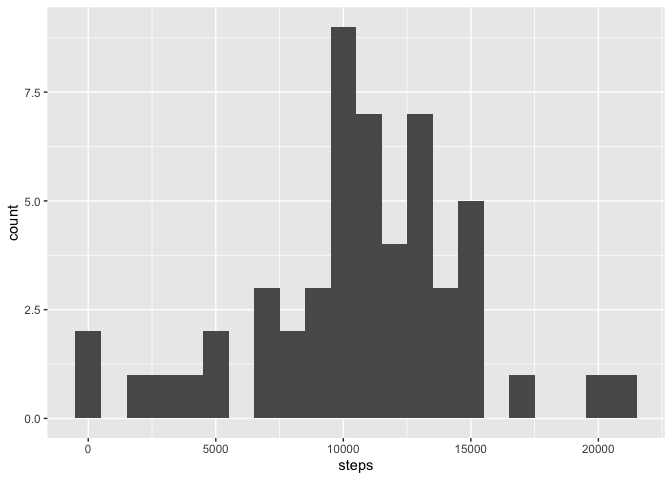
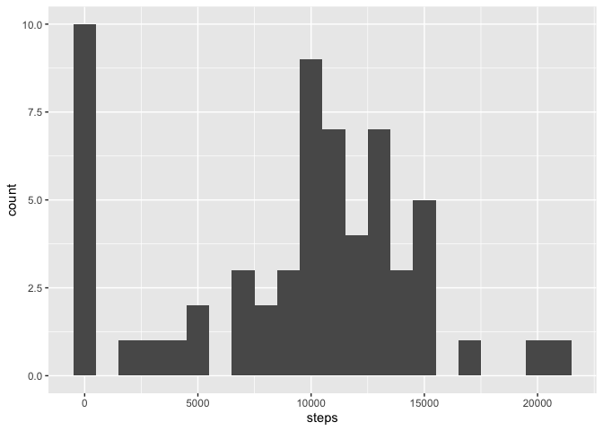
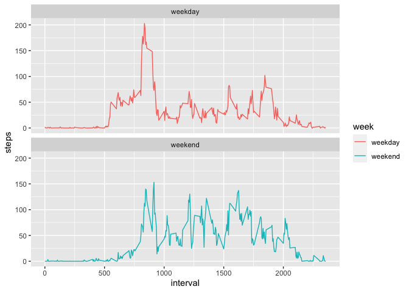

  
---
title: "Reproducible Research: Peer-graded Assignment: Course Project 1"
output: 
  html_document:
    keep_md: true
---

## Loading and preprocessing the data

```r
library(data.table)
library(ggplot2)
```

```
## Warning: package 'ggplot2' was built under R version 4.0.2
```

```r
data <- unzip("activity.zip")
data <- fread("activity.csv")
head(data)
```

```
##    steps       date interval
## 1:    NA 2012-10-01        0
## 2:    NA 2012-10-01        5
## 3:    NA 2012-10-01       10
## 4:    NA 2012-10-01       15
## 5:    NA 2012-10-01       20
## 6:    NA 2012-10-01       25
```

```r
str(data)
```

```
## Classes 'data.table' and 'data.frame':	17568 obs. of  3 variables:
##  $ steps   : int  NA NA NA NA NA NA NA NA NA NA ...
##  $ date    : chr  "2012-10-01" "2012-10-01" "2012-10-01" "2012-10-01" ...
##  $ interval: int  0 5 10 15 20 25 30 35 40 45 ...
##  - attr(*, ".internal.selfref")=<externalptr>
```

```r
data[, date := as.POSIXct(date, format = "%Y-%m-%d")]
```

## What is mean total number of steps taken per day?
Calculate the total number of steps taken per day

```r
totalsteps <- data[, c(lapply(.SD, sum, na.rm = FALSE)), .SDcols = c("steps"), by = "date"] 
totalsteps
```

```
##           date steps
##  1: 2012-10-01    NA
##  2: 2012-10-02   126
##  3: 2012-10-03 11352
##  4: 2012-10-04 12116
##  5: 2012-10-05 13294
##  6: 2012-10-06 15420
##  7: 2012-10-07 11015
##  8: 2012-10-08    NA
##  9: 2012-10-09 12811
## 10: 2012-10-10  9900
## 11: 2012-10-11 10304
## 12: 2012-10-12 17382
## 13: 2012-10-13 12426
## 14: 2012-10-14 15098
## 15: 2012-10-15 10139
## 16: 2012-10-16 15084
## 17: 2012-10-17 13452
## 18: 2012-10-18 10056
## 19: 2012-10-19 11829
## 20: 2012-10-20 10395
## 21: 2012-10-21  8821
## 22: 2012-10-22 13460
## 23: 2012-10-23  8918
## 24: 2012-10-24  8355
## 25: 2012-10-25  2492
## 26: 2012-10-26  6778
## 27: 2012-10-27 10119
## 28: 2012-10-28 11458
## 29: 2012-10-29  5018
## 30: 2012-10-30  9819
## 31: 2012-10-31 15414
## 32: 2012-11-01    NA
## 33: 2012-11-02 10600
## 34: 2012-11-03 10571
## 35: 2012-11-04    NA
## 36: 2012-11-05 10439
## 37: 2012-11-06  8334
## 38: 2012-11-07 12883
## 39: 2012-11-08  3219
## 40: 2012-11-09    NA
## 41: 2012-11-10    NA
## 42: 2012-11-11 12608
## 43: 2012-11-12 10765
## 44: 2012-11-13  7336
## 45: 2012-11-14    NA
## 46: 2012-11-15    41
## 47: 2012-11-16  5441
## 48: 2012-11-17 14339
## 49: 2012-11-18 15110
## 50: 2012-11-19  8841
## 51: 2012-11-20  4472
## 52: 2012-11-21 12787
## 53: 2012-11-22 20427
## 54: 2012-11-23 21194
## 55: 2012-11-24 14478
## 56: 2012-11-25 11834
## 57: 2012-11-26 11162
## 58: 2012-11-27 13646
## 59: 2012-11-28 10183
## 60: 2012-11-29  7047
## 61: 2012-11-30    NA
##           date steps
```

Here is a histogram of the total number of steps taken each day

```r
g <- ggplot(totalsteps, aes(steps)) 
g + geom_histogram(binwidth = 1000) 
```

```
## Warning: Removed 8 rows containing non-finite values (stat_bin).
```

<!-- -->

Calculate and report the mean and median of the total number of steps taken per day

```r
mean <- mean(totalsteps$steps, na.rm = TRUE)
mean
```

```
## [1] 10766.19
```

```r
median <- median(totalsteps$steps, na.rm = TRUE)
median
```

```
## [1] 10765
```


## What is the average daily activity pattern?
Make a time series plot (i.e. type = "l") of the 5-minute interval (x-axis) and the average number of steps taken, averaged across all days (y-axis)

```r
interval <- data[, c(lapply(.SD, mean, na.rm = TRUE)), .SDcols = c("steps"), by = "interval"] 
g <- ggplot(interval, aes(x = interval , y = steps))
g + geom_line()
```

<!-- -->

Which 5-minute interval, on average across all the days in the dataset, contains the maximum number of steps?

```r
interval[steps == max(steps)]
```

```
##    interval    steps
## 1:      835 206.1698
```

## Imputing missing values
Calculate and report the total number of missing values in the dataset (i.e. the total number of rows with NAs)

```r
sum(is.na(data))
```

```
## [1] 2304
```

Devise a strategy for filling in all of the missing values in the dataset. The strategy does not need to be sophisticated. For example, you could use the mean/median for that day, or the mean for that 5-minute interval, etc.
Create a new dataset that is equal to the original dataset but with the missing data filled in.

```r
data[is.na(steps), "steps"] <- data[, c(lapply(.SD, median, na.rm = TRUE)), .SDcols = c("steps")]
```

Make a histogram of the total number of steps taken each day and Calculate and report the mean and median total number of steps taken per day. Do these values differ from the estimates from the first part of the assignment? What is the impact of imputing missing data on the estimates of the total daily number of steps?

```r
totalsteps2 <- data[, c(lapply(.SD, sum)), .SDcols = c("steps"), by = "date"] 
mean2 <- mean(totalsteps2$steps)
mean2
```

```
## [1] 9354.23
```

```r
median2 <- median(totalsteps2$steps)
median2
```

```
## [1] 10395
```

```r
g <- ggplot(totalsteps2, aes(steps)) 
g + geom_histogram(binwidth = 1000) 
```

<!-- -->
Without NAs, both mean and median decreased.


## Are there differences in activity patterns between weekdays and weekends?
Create a new factor variable in the dataset with two levels – “weekday” and “weekend” indicating whether a given date is a weekday or weekend day.

```r
data$week <- ifelse(weekdays(data$date) %in% c("Saturday", "Sunday"), "weekend", "weekday")
head(data)
```

```
##    steps       date interval    week
## 1:     0 2012-10-01        0 weekday
## 2:     0 2012-10-01        5 weekday
## 3:     0 2012-10-01       10 weekday
## 4:     0 2012-10-01       15 weekday
## 5:     0 2012-10-01       20 weekday
## 6:     0 2012-10-01       25 weekday
```

Make a panel plot containing a time series plot (type = "l") of the 5-minute interval (x-axis) and the average number of steps taken, averaged across all weekday days or weekend days (y-axis).

```r
data[is.na(steps), "steps"] <- data[, c(lapply(.SD, median, na.rm = TRUE)), .SDcols = c("steps")]
interval <- data[, c(lapply(.SD, mean, na.rm = TRUE)), .SDcols = c("steps"), by = .(interval, `week`)] 
g <- ggplot(interval , aes(x = interval , y = steps, color=`week`)) 
g + geom_line() + facet_wrap(~`week` , ncol = 1, nrow=2)
```

<!-- -->
